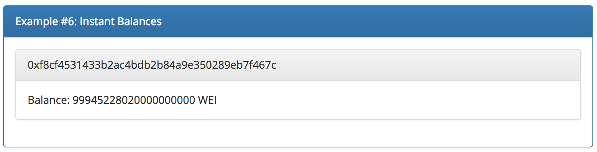
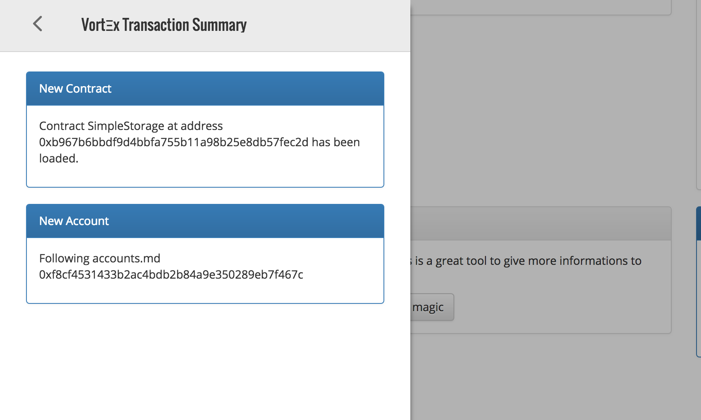
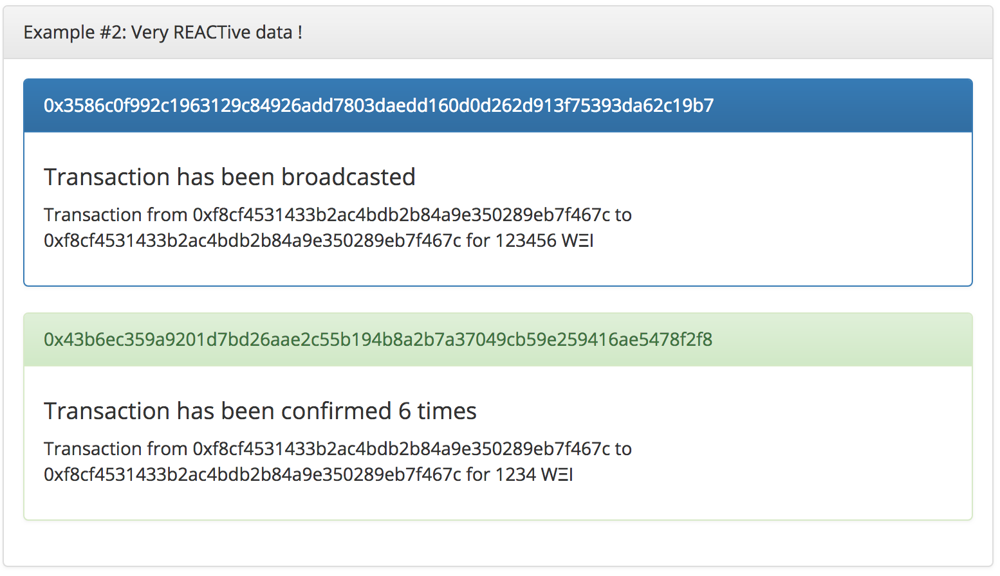
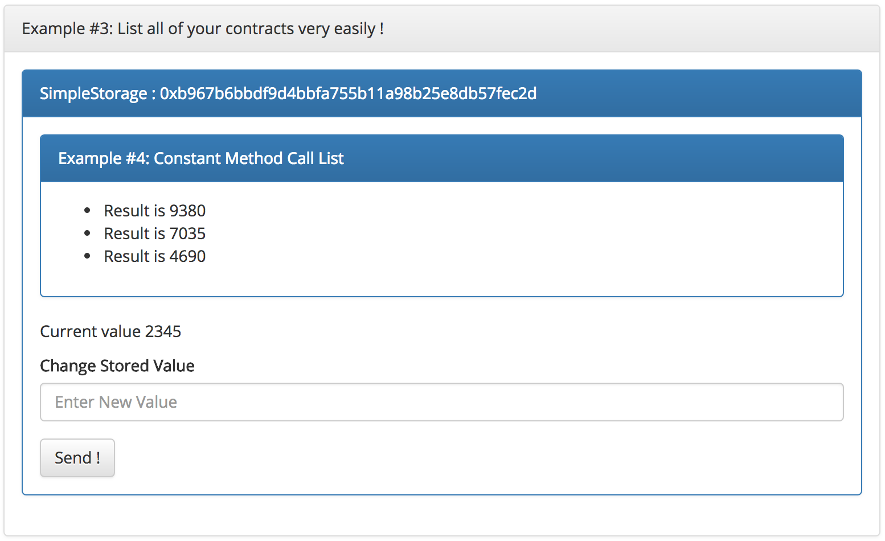

# Tutorial

This tutorial will explain how to use the Vortex and Vortex Components packages in a React Dapp.
The first part will speak about how to use Vortex in a React Dapp (if you want to manually instantiate it and connect your components to the store).
The second part will explain how to use the Generic Vortex Components.

## Installing

Both Vortex and Vortex Components are available on the public npm registry. You can simply run:

```npm
npm install --save vort_x vort_x-components
```
## Vortex

#### Creating a classic Vortex instance for Truffle Users

Creating a [Vortex](./reference/classes/vortex.md) instance is quite easy. Start by importing the Vortex class from the `vort_x` package.

```javascript
// ES6 or TS
import { Vortex } from 'vort_x';
// or
const Vortex = require('vort_x').Vortex;
```

Then, call the factory constructor.

```
const SimpleStorage = require("SimpleStorage.json");
const MySmartContract = require("MySmartContract.json");

const web3_loader = new Promise((ok, ko) => {
    try {
        let web3 = // Recover your web3 instance as you want.
        ok(web3);
    } catch (e) {
        ko(e);
    }
});

const instance = Vortex.factory({
        type: 'truffle',
        contracts: [SimpleStorage, MySmartContract],
        preloaded_contracts: ["SimpleStorage"]
    }, web3_loader);
```

As a first argument, you will need to provide this object

```
{
   type: 'truffle',
   contracts: [SimpleStorage, MySmartContract],
   preloaded_contracts: ["SimpleStorage"]
}
```

`type` here defines the framework being used. Here we use `truffle`.

`contracts` is an array of **Truffle** artifacts (generated by `truffle migrate`).

`preloaded_contracts` is an array of contract names you want to load when instantiating.

Your instance is ready to be run, but you can still tweak your store before running it.

You can recover this instance at any time by calling the static `get` method on Vortex (will only store the last instance, but you'll never need two instances of Vortex).

#### Creating a classic Vortex instance for Embark Users

```javascript
// ES6 or TS
import { Vortex } from 'vort_x';
// or
const Vortex = require('vort_x').Vortex;
```

Then, call the factory constructor.

```javascript
import simple_storage from 'Embark/contracts/SimpleStorage';
import my_smart_contract from 'Embark/contracts/SimpleStorage';
import * as Chains from 'path/to/embark/dir/chains.json'

const web3_loader = new Promise((ok, ko) => {
    try {
        let web3 = // Recover your web3 instance as you want.
        ok(web3);
    } catch (e) {
        ko(e);
    }
});

const instance = Vortex.factory({
        type: 'embark',
        contracts: {
            SimpleStorage: simple_storage,
            MySmartContract: my_smart_contract
        },
        chains: Chains,
        preloaded_contracts: ["SimpleStorage"]
    }, web3_loader);
```

As a first argument, you will need to provide this object

```javascript
{
   type: 'embark',
   contracts: {
       SimpleStorage: simple_storage,
       MySmartContract: my_smart_contract
   },
   chains: Chains,
   preloaded_contracts: ["SimpleStorage"]
}
```

`type` here defines the framework being used. Here we use `embark`.

`contracts` is an object filled with contracts instance from Embark.

`preloaded_contracts` is an array of contract names you want to load when instantiating.

Your instance is ready to be run, but you can still tweak your store before running it.

You can recover this instance at any time by calling the static `get` method on Vortex (will only store the last instance, but you'll never need two instances of Vortex).

#### Creating an extended Vortex instance

The Vortex store is quite modular and allows you to plug your own reducers and set your starting state.
Let's assume that you want to add a new entry `profile` in the store, and that you have created your actions and reducer.

```javascript
const SimpleStorage = require("SimpleStorage.json");
const MySmartContract = require("MySmartContract.json");
const profile_reducer = require("./profile_reducer");
const initial_state = {
    profile: {
        username: 'John Doe'
    }
}

const web3_loader = new Promise((ok, ko) => {
    try {
        let web3 = // Recover your web3 instance as you want.
        ok(web3);
    } catch (e) {
        ko(e);
    }
});

const instance = Vortex.factory([SimpleStorage, MySmartContract], web3_loader, {
    reducer: {profile: profile_reducer},
    custom_state: initial_state
});
```

Now your store will behave exactly like before, but it will also support your profile actions.

Configuration options are:

* **reducer**: An object containing the reducers you want to merge with the Vortex Store. Default: `undefined`
* **custom_state**: An object defining your initial state, that will be merged with the Vortex initial state. Default: `undefined`
* **account_refresh_rate**: A refresh rate (in ms) for account balance refresh. Default: `5000`

#### Preparing before running

Before really running the Vortex Store, you can still tweak your settings with the following methods from the Vortex class.

* [**addContract**](./reference/classes/vortex.md#addcontract)

This will add a new contract (just like if you gave it at instantiation).

* [**addNetwork**](./reference/classes/vortex.md#addnetwork)

This will add a network id to the whitelist. If the whitelist remains empty, no network checks will be done by Vortex.

* [**networksOf**](./reference/classes/vortex.md#networksof)

This method takes a **Truffle** artifact and adds all the networks where it has been deployed to the whitelist. Can be called on multiple artifacts.

You can find all of the tweakers on the [**Vortex**](./reference/classes/vortex.md) class documentation.

#### Running Vortex

Now that you have configured your Vortex, it is time for you to run it.

```javascript
instance.run()
```

Will start the store.

```
instance.loadWeb3()
```

Will give the order to load the web3 instance from the loader you have provided during creation.

#### Using in React

Now, you might want to use Vortex in your React App. The best thing to do for you will be to read some [Redux Documentation](https://redux.js.org/basics).
Then, you should have a look at the source code of the different [Vortex Components](https://github.com/Horyus/vort_x-components) and [Vortex Demo](https://github.com/Horyus/vort_x-demo), it will show you how to start an instance,
connect your components and make transactions. This will be a good training, and will maybe make you discover components that are already doing what you want to do.

The first thing you should watch is the VortexGate component and how it is used in the demo. It's the component that will create the instance and provide it in its context, while also managing what should be rendered depending on web3 status.

## Vortex Components

## [VortexGate](https://github.com/Horyus/vort_x-components/blob/master/src/components/vortex-components/vortex-gate/index.tsx)

VortexGate is the core component and should be the topmost component of your App. It will create a Vortex instance and manage what should be rendered or not. Very easy to use, it takes arguments similar to the factory, and should have 4 child components:

[Usage Example](https://github.com/Horyus/vort_x-demo/blob/master/src/App.js#L22)

For Truffle
```javascript
import {App} from './main';
import SimpleStorage from 'SimpleStorage';
import Web3 from web3;
import {VortexGate, VortexWeb3Loaded, VortexWeb3LoadError, VortexWeb3NetworkError, VortexWeb3Loading, VortexMetamaskLoader} from 'vort_x-components';
import React from 'react'

class Main extends React.Component {
    render() {
        return (
        <VortexGate contracts={
                type: 'truffle',
                contracts: [SimpleStorage],
                preloaded_contracts: ["SimpleStorage"]
            } network_contracts={[SimpleStorageContract]} loader={VortexMetamaskLoader(Web3)}>
            <VortexWeb3Loaded>
                <App/>
            </VortexWeb3Loaded>

            <VortexWeb3Loading>
                <h1>Loading ... </h1>
            </VortexWeb3Loading>

            <VortexWeb3LoadError>
                <h1>Oops!</h1>
                <p>Looks like there is a problem with your Web3. Check that you unlocked your account, that Web3 is properly connected to a network and that your loader resolves a web3@1.0.0+ version of Web3 !</p>
            </VortexWeb3LoadError>

            <VortexWeb3NetworkError>
                <h1>Oops!</h1>
                <p>We could not find your smart contracts on the current network :(.<br/> Please check if you are on the good network !</p>
            </VortexWeb3NetworkError>

        </VortexGate>
        );
    }
}
```

For Embark
```javascript
import {App} from './main';
import SimpleStorage from 'Embarks/contracts/SimpleStorage';
import * as Chains from '/path/to/embark/dir/chains.json';
import Web3 from web3;
import {VortexGate, VortexWeb3Loaded, VortexWeb3LoadError, VortexWeb3NetworkError, VortexWeb3Loading, VortexMetamaskLoader} from 'vort_x-components';
import React from 'react'

class Main extends React.Component {
    render() {
        return (
        <VortexGate contracts={
                type: 'embark',
                contracts: [SimpleStorage],
                chains: Chains,
                preloaded_contracts: ["SimpleStorage"]
            } loader={VortexMetamaskLoader(Web3)}>
            <VortexWeb3Loaded>
                <App/>
            </VortexWeb3Loaded>

            <VortexWeb3Loading>
                <h1>Loading ... </h1>
            </VortexWeb3Loading>

            <VortexWeb3LoadError>
                <h1>Oops!</h1>
                <p>Looks like there is a problem with your Web3. Check that you unlocked your account, that Web3 is properly connected to a network and that your loader resolves a web3@1.0.0+ version of Web3 !</p>
            </VortexWeb3LoadError>

            <VortexWeb3NetworkError>
                <h1>Oops!</h1>
                <p>We could not find your smart contracts on the current network :(.<br/> Please check if you are on the good network !</p>
            </VortexWeb3NetworkError>

        </VortexGate>
        );
    }
}
```

You must provide the 4 components or the VortexGate won't load. Depending on how Web3 is resolved, one of the four following components will be rendered.

###### Props

* **loader** (mandatory)

The Web3 loader that will be passed to Vortex. VortexMetamaskLoader is an helper function that will instantiate a Web3 instance of the version you provide (should be 1.0.0+)

* **contracts** (mandatory)

The Contracts you want to load (**Truffle** artifacts)

* **network_contracts**

The Contracts that will be passed to the `networksOf` method of Vortex.

/!\ This only works for Truffle, Embark manages contract instances with the `chains.json` file.

* **reducers_map**

Custom reducers map.

* **custom_state**

Custom initial state.

## [VortexAccount](https://github.com/Horyus/vort_x-components/blob/master/src/components/vortex-components/vortex-account/index.tsx)

The Vortex Account takes a ComponentClass as argument, connects it to specified account and render it. The rendered component will be updated as soon as the store receives new data.

[Usage Example](https://github.com/Horyus/vort_x-demo/blob/master/src/demo-sections/account_follower/index.js#L17)

```javascript
import * as React from "react";
import {VortexAccount, connect} from "vort_x-components";
import {Panel} from "react-bootstrap";

export class DataContainer extends React.Component {
    render() {
        return (<Panel>
            <Panel.Heading>{this.props.address}</Panel.Heading>
            <Panel.Body>Balance: {this.props.account ? this.props.account.balance + " WEI" : "Loading ..."}</Panel.Body>
        </Panel>);
    }
}

export class _AccountFollower extends React.Component {
    render() {
        return (<div>
            <VortexAccount element={DataContainer} account_address={this.props.web3.coinbase}/>
        </div>);
    }
}

const mapStateToProps = (state) => {
    return {
        web3: state.web3
    }
};

export const AccountFollower = connect(_AccountFollower, mapStateToProps);
```



###### Props

* **element** (mandatory)

A ComponentClass that will be rendered. Will receive `address` and `account` props. `address` will be the hex string address, and `account` will be the connected prop (you will receive what is in the store at `state.accounts[address]`).

* **account_address** (mandatory)

The account address you want your component to be connected. Will start following the account is not already in store.

* **element_props**

Props that will be given to the instance of element.

## [VortexFeedList](https://github.com/Horyus/vort_x-components/tree/master/src/components/vortex-components/vortex-feed-list)

The VortexFeedList allows you to generate an array of child components, each one of them connected to a different element from the Feed section of the store. You can filter what kind of elements you want to render. This means you could have an array of components connected on every single new transactions, and this array will be updated only when new transactions are emitted.

[Usage Example](https://github.com/Horyus/vort_x-demo/blob/master/src/demo-sections/left-overlay/index.js#77)

```
import React, { Component} from 'react';
import Modal from 'react-modal';
import SlidingPane from 'react-sliding-pane';
import {Panel, Button} from 'react-bootstrap';
import 'react-sliding-pane/dist/react-sliding-pane.css';
import {VortexFeedList, FeedType} from 'vort_x-components';

class ListElement extends Component {
    constructor(props) {
        super(props);
        this.title = "";
        this.body = "";
        this.style = "danger";
        switch (this.props.data.action) {
            case 'NEW_CONTRACT':
                this.title = "New Contract";
                this.body = "Contract " + this.props.data.contract_name + " at address " + this.props.data.contract_address + " has been loaded.";
                this.style = "primary";
                break;
            case 'NEW_TRANSACTION':
                this.title = "New Transaction";
                this.body = "Transaction " + this.props.data.transaction_hash + " has been broadcasted";
                this.style = "success";
                break;
            case 'NEW_ERROR':
                this.title = "New Error";
                this.body = this.props.data.error.message;
                break;
            case 'NEW_ACCOUNT':
                this.title = "New Account";
                this.body = "Following accounts.md " + this.props.data.account;
                this.style = "primary";
                break;
            default:
                this.title = "Unknown action";
        }

    }
    render() {
        return <Panel bsStyle={this.style}>
            <Panel.Heading>{this.title}</Panel.Heading>
            <Panel.Body style={{wordWrap: 'break-word'}}>
                <p>{this.body}</p>
            </Panel.Body>
        </Panel>
    }
}

export class Overlay extends Component {
    constructor(props) {
        super(props);
        this.state = {
            isPaneOpen: false,
            isPaneOpenLeft: false
        };
    }

    componentDidMount() {
        Modal.setAppElement(this.el);
    }

    render() {
        return <Panel>
            <Panel.Heading >Example #5: Press this magic button !</Panel.Heading>
            <Panel.Body>
                <p>You can easily access all the data created by your user's activity. This is a great tool to give more informations to the user about what is happening behind the scene.</p>
                <div ref={ref => this.el = ref}>
                    <Button onClick={ () => this.setState({ isPaneOpenLeft: true }) }>
                        This is the Magic Button, press me if you want to see puuuuuure magic
                    </Button>
                    <SlidingPane
                        isOpen={ this.state.isPaneOpenLeft }
                        title='Vortex Transaction Summary'
                        from='left'
                        width={(Math.floor(window.innerWidth * 0.3)).toString() + "px"}
                        onRequestClose={ () => this.setState({ isPaneOpenLeft: false }) }>
                        <VortexFeedList filter={FeedType.Contracts | FeedType.Errors | FeedType.Transactions | FeedType.Accounts } element={ListElement}/>
                    </SlidingPane>
                </div>
            </Panel.Body>
        </Panel>;
    }
}
```



The above example uses the `react-sliding-pane` library to create a sliding pane containing every single Feed element. If you want your VortexFeedList to only render Transactions and Contracts, you can give `filter={FeedType.Transactions | FeedType.Contracts}` as `filter` prop.

###### Props

* **filter** (mandatory)

As described above, indicates what type of Feed elements should be rendered.

* **element** (mandatory)

A ComponentClass that should accept a `data` prop, contained a connected Feed element.

* **container**

A ComponentClass that will wrap the `element` instances

```
<container {...container_props}>
    <element {...element_props} data={connected to Vortex Store}/>
    <element {...element_props} data={connected to Vortex Store}/>
    <element {...element_props} data={connected to Vortex Store}/>
    <element {...element_props} data={connected to Vortex Store}/>
</container>
```

* **container_props**

Props that will be given to the instance of container.

* **element_props**

Props that will be given to the instance of element.

## [VortexTransactionsList](https://github.com/Horyus/vort_x-components/blob/master/src/components/vortex-components/vortex-transactions-list/index.tsx)

This component will render child elements connected to each new emitted transactions (manual transaction or even contract method call).
The difference between this component and VortexFeedList is that this one actually connects the component on the new transactions (`state.tx[transaction_hash]`) and not on the Feed element.

[Usage Example](https://github.com/Horyus/vort_x-demo/blob/master/src/demo-sections/list-transactions/index.js#L50)

```javascript
import * as React from "react";
import {VortexTransactionsList} from 'vort_x-components';
import {Panel} from "react-bootstrap";

class TxContainer extends React.Component {
    render() {
        if (this.props.tx) {
            let status = "warning";
            let status_title;
            switch (this.props.tx.status.type) {
                case 'BROADCASTED':
                    status = "primary";
                    status_title = "Transaction has been broadcasted";
                    break;
                case 'CONFIRMED':
                    status = "success";
                    status_title = "Transaction has been confirmed " + this.props.tx.status.transaction_confirmation_count + " times";
                    break;
                case 'RECEIPT':
                    status = "success";
                    status_title = "Transaction receipt has been received";
                    break ;
                case 'ERROR':
                    status = "danger";
                    status_title = "Error occured while doing transaction";
                    break ;
                default:
                    status = "danger";
                    break ;
            }
            return <Panel bsStyle={status}>
                <Panel.Heading>{this.props.tx.status.transaction_hash}</Panel.Heading>
                <Panel.Body>
                    <h4>{status_title}</h4>
                    <p>Transaction
                        from {this.props.tx.transaction_arguments.from} to {this.props.tx.transaction_arguments.to} for {parseInt(this.props.tx.transaction_arguments.value, 16)} WΞI</p>
                </Panel.Body>
            </Panel>;
        } else
            return <div/>;
    }
}

export class ListTransactions extends React.Component {

    render() {
        return <Panel>
            <Panel.Heading>Very REACTive data !</Panel.Heading>
            <Panel.Body style={{maxHeight: 400, overflow: 'scroll'}}>
                <VortexTransactionsList element={TxContainer}/>
            </Panel.Body>
        </Panel>
    }

}
```



###### Props

* **element** (mandatory)

A ComponentClass that should accept a `tx` prop, contained a connected Tx element.

* **element_props**

Props that will be given to the instance of element.

* **container**


A ComponentClass that will wrap the `element` instances

```
<container {...container_props}>
    <element {...element_props} data={connected to Vortex Store}/>
    <element {...element_props} data={connected to Vortex Store}/>
    <element {...element_props} data={connected to Vortex Store}/>
    <element {...element_props} data={connected to Vortex Store}/>
</container>
```

* **container_props**

Props that will be given to the instance of container.

## [VortexContractsList](https://github.com/Horyus/vort_x-components/blob/master/src/components/vortex-components/vortex-contracts-list/index.tsx)

Same as the transactions, but with contract instances. Also you can give a Smart Contract name and it will filter contracts for the one specified.

[Usage Example](https://github.com/Horyus/vort_x-demo/blob/master/src/demo-sections/list-contracts/index.js#L87)

```
import * as React from "react";
import {VortexContractsList, connect, VortexMethodCallList} from 'vort_x-components';
import {FormGroup, ControlLabel, FormControl, HelpBlock, Button} from 'react-bootstrap';
import {Panel} from "react-bootstrap";
import {CallContainer, SingleCall} from "../list-method-calls";

function FieldGroup({ id, label, help, ...props }) {
    return (
        <FormGroup controlId={id}>
            <ControlLabel>{label}</ControlLabel>
            <FormControl {...props} />
            {help && <HelpBlock>{help}</HelpBlock>}
        </FormGroup>
    );
}

class ContractCallReturnContainer extends React.Component {

    constructor(props) {
        super(props);
        this.newValue = this.newValue.bind(this);
    }

    newValue(event) {
        event.preventDefault();
        this.props.update(this.newVal.valueAsNumber);
    }

    render() {
        return (<div>
            <p>Current value {this.props.result}</p>
            <form onSubmit={this.newValue}>
                <FieldGroup
                    id="newVal"
                    type="number"
                    label="Change Stored Value"
                    placeholder="Enter New Value"
                    inputRef={input => this.newVal = input}
                />
                <Button type="submit">Send !</Button>
            </form>
        </div>)
    }
}

class ContractsContainer extends React.Component {
    constructor(props) {
        super(props);
        this.props.contract.instance.vortex.get.vortexData({from: this.props.web3.coinbase});
        const mapStateToProps = (state) => {
            return {
                result: state.contracts[this.props.contract_name][this.props.contract_address].instance.vortex.get.vortexData({from: this.props.web3.coinbase}),
                update: (newValue) => {
                    this.props.contract.instance.vortex.set.vortexSend({from: this.props.web3.coinbase, gas: 20000000}, newValue);
                }
            }
        };
        this.resultContainer = connect(ContractCallReturnContainer, mapStateToProps);
    }

    render() {
        if (this.props.contract) {
            return <Panel bsStyle="primary">
                <Panel.Heading>{this.props.contract_name} : {this.props.contract_address}</Panel.Heading>
                <Panel.Body>
                    <VortexMethodCallList container={CallContainer} element={SingleCall} methodName="times" contractName={this.props.contract_name} contractAddress={this.props.contract_address} arguments={
                        [
                            [{from: this.props.web3.coinbase}, 2],
                            [{from: this.props.web3.coinbase}, 3],
                            [{from: this.props.web3.coinbase}, 4]
                        ]
                    }/>
                    <this.resultContainer/>
                </Panel.Body>
            </Panel>;
        } else
            return <div/>;
    }
}

export class ListContracts extends React.Component {

    render() {
        return <Panel>
            <Panel.Heading>List all of your contracts very easily !</Panel.Heading>
            <Panel.Body>
                <VortexContractsList element={ContractsContainer} contract_name="SimpleStorage"/>
            </Panel.Body>
        </Panel>
    }

}
```



###### Props

* **element** (mandatory)

A ComponentClass that should accept the `contract`, `contract_name`, `contract_address` and `web3` props.

* **element_props**

Props that will be given to the instance of element.

* **container**


A ComponentClass that will wrap the `element` instances

```
<container {...container_props}>
    <element {...element_props} data={connected to Vortex Store}/>
    <element {...element_props} data={connected to Vortex Store}/>
    <element {...element_props} data={connected to Vortex Store}/>
    <element {...element_props} data={connected to Vortex Store}/>
</container>
```

* **container_props**

Props that will be given to the instance of container.

* **contract_name**

Name of contracts you want to receive

## [VortexMethodCallList](https://github.com/Horyus/vort_x-components/blob/master/src/components/vortex-components/vortex-method-call-list/index.tsx)

This component will generate child components based on given arguments. You can give an array of method calls and you will have one component rendered with the result of the call.

[Usage Example](https://github.com/Horyus/vort_x-demo/blob/master/src/demo-sections/list-contracts/index.js#L66)

###### Props

* **element** (mandatory)

A ComponentClass that should accept the `contract`, `contract_name`, `contract_address` and `web3` props.

* **contractName** (mandatory)

Name of the Smart Contract.

* **contractAddress** (mandatory)

Address of Smart Contract instance.

* **methodName** (mandatory)

Name of method to call

* **arguments** (mandatory)

An array of arrays of arguments. The first argument for each call should be the transaction arguments (`from`, `to`, etc...)

For a method `times` taking one `uint` argument, you will have this

```
[
    [{from: this.props.web3.coinbase}, 2],
    [{from: this.props.web3.coinbase}, 3],
    [{from: this.props.web3.coinbase}, 4]
]
```

With this argument, 3 child components will be rendered, and will contain the result of `times(2)`, `times(3)` and `times(4)` with `{from: this.props.web3.coinbase}` as transaction arguments.

* **element_props**

Props that will be given to the instance of element.

* **container**


A ComponentClass that will wrap the `element` instances

```
<container {...container_props}>
    <element {...element_props} data={connected to Vortex Store}/>
    <element {...element_props} data={connected to Vortex Store}/>
    <element {...element_props} data={connected to Vortex Store}/>
    <element {...element_props} data={connected to Vortex Store}/>
</container>
```

* **container_props**

Props that will be given to the instance of container.


